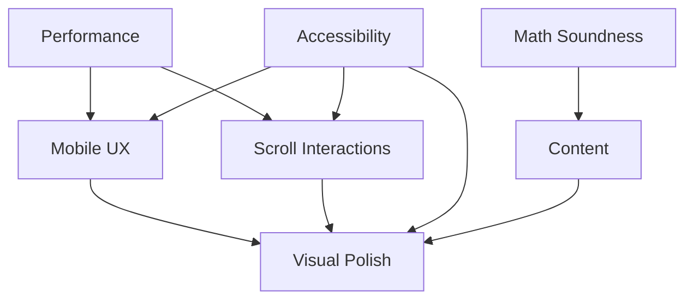

# GitHub Issues Master Index

## 📋 Overview

This directory contains comprehensive, mathematically sound, and futuristic GitHub issue templates for the Christopher Sellers portfolio website. Each issue is designed to be crisp, clear, actionable, and aligned with achieving world-class (Tier 1) design status.

## 🎯 Issue Categories

### 1. 🚀 Performance Optimization
**File:** `01-performance-optimization.md`
**Priority:** Critical
**Estimated Impact:** +0.3 score points

**Focus Areas:**
- Code splitting and lazy loading
- Bundle size reduction (target: <100KB initial)
- Asset optimization (WebP, responsive images)
- Runtime performance (60fps constant)
- Caching strategies

**Mathematical Targets:**
```
Initial Load: <100KB (gzip)
First Contentful Paint: <0.8s
Time to Interactive: <1.5s
Lighthouse Score: 95+
```

---

### 2. 📱 Mobile UX Enhancement
**File:** `02-mobile-ux-enhancement.md`
**Priority:** High
**Estimated Impact:** +0.2 score points

**Focus Areas:**
- Touch target optimization (44px+ minimum)
- Mobile-optimized Lab view
- Touch gestures for 3D scene
- Responsive layouts with fluid typography
- Mobile performance optimization

**Mathematical Model:**
```
Touch Target Size: ≥44px × 44px
Touch Accuracy: A ≥ 0.95
Mobile Lighthouse: 95+
60fps Scroll: constant
```

---

### 3. 🧮 Mathematical Soundness & Neural Network Accuracy
**File:** `03-mathematical-soundness.md`
**Priority:** High
**Estimated Impact:** Accuracy & credibility

**Focus Areas:**
- Gradient checking and verification
- Numerical stability (prevent NaN/Infinity)
- Weight initialization (He/Xavier)
- Backpropagation correctness
- Loss function enhancements
- Regularization (L1/L2)

**Validation Metrics:**
```
Gradient Relative Error: <1e-5
Overflow Rate: 0
Training Convergence: Monotonic decrease
Model Accuracy: >95%
```

---

### 4. ♿ Accessibility Excellence
**File:** `04-accessibility-excellence.md`
**Priority:** High
**Estimated Impact:** Inclusive design + compliance

**Focus Areas:**
- WCAG 2.1 Level AAA compliance
- Keyboard navigation excellence
- Screen reader optimization
- Color contrast (7:1 AAA ratio)
- Reduced motion support
- Focus management

**Compliance Targets:**
```
Lighthouse A11y: 100/100
WCAG Level: AAA
Contrast Ratio: ≥7:1
axe Violations: 0
```

---

### 5. ✨ Advanced Scroll Interactions
**File:** `05-advanced-scroll-interactions.md`
**Priority:** Medium
**Estimated Impact:** +0.2 score points

**Focus Areas:**
- Scroll-driven animations
- Parallax effects (multi-layer)
- Smooth scroll implementation
- Horizontal scroll sections
- Scroll progress indicators
- Story-driven sections

**Performance Budget:**
```
Scroll FPS: 60fps constant
Jank-free: 99%+ frames
Input Latency: <16ms
CPU Usage: <50%
```

---

### 6. 📚 Content Depth & Storytelling
**File:** `06-content-depth-storytelling.md`
**Priority:** Medium
**Estimated Impact:** +0.2 score points

**Focus Areas:**
- Detailed case studies (3+)
- Process and methodology explanation
- Data-driven metrics dashboard
- Testimonials and social proof
- Personal story and expertise
- Comprehensive FAQ section

**Content Targets:**
```
Time on Page: >3:00
Scroll Depth: 80%+
Case Study Views: 70%+
Total Words: 5000-6500
```

---

### 7. 🎨 Visual Polish & Micro-interactions
**File:** `07-visual-polish-microinteractions.md`
**Priority:** Medium
**Estimated Impact:** +0.1 score points (final polish)

**Focus Areas:**
- Magnetic button effects
- Card hover animations (3D tilt)
- Custom cursor with states
- Toast notification system
- Loading skeletons
- Form input polish
- Smooth transitions

**Quality Metrics:**
```
Animation FPS: 60fps
Interaction Response: <50ms
Animation Smoothness: 100%
CPU During Animation: <30%
```

---

## 📊 Impact Analysis

### Score Progression Path
```
Current Score: 4.4/5 (88%)
Target Score:  4.7/5 (94%)

Breakdown:
├─ Performance (+0.3):     4.4 → 4.5
├─ Mobile UX (+0.2):       4.5 → 4.6
├─ Scroll (+0.2):          4.6 → 4.7
├─ Content (+0.2):         4.7 → 4.8
├─ Polish (+0.1):          4.8 → 4.9
└─ Accessibility (0):      Maintain AAA
```

### Priority Matrix
```
Priority   Issues                Impact  Effort
─────────────────────────────────────────────
Critical   Performance          High    High
High       Mobile UX            High    Medium
High       Math Soundness       Medium  Medium
High       Accessibility        High    Medium
Medium     Scroll Interactions  Medium  Medium
Medium     Content Depth        High    High
Medium     Visual Polish        Low     Low
```

## 🎯 Implementation Strategy

### Phase 1: Foundation (Weeks 1-2)
**Goal:** Achieve critical infrastructure improvements

1. ✅ Performance Optimization
   - Code splitting
   - Bundle reduction
   - Asset optimization

2. ✅ Mathematical Soundness
   - Gradient verification
   - Numerical stability
   - Accuracy validation

3. ✅ Accessibility Excellence
   - WCAG AAA compliance
   - Keyboard navigation
   - Screen reader support

**Expected Score:** 4.5/5 (90%)

---

### Phase 2: Experience Enhancement (Weeks 3-4)
**Goal:** Elevate user experience and engagement

1. ✅ Mobile UX Enhancement
   - Touch optimization
   - Mobile Lab view
   - Responsive refinement

2. ✅ Advanced Scroll Interactions
   - Parallax effects
   - Scroll animations
   - Smooth scroll

**Expected Score:** 4.6/5 (92%)

---

### Phase 3: Content & Polish (Weeks 5-6)
**Goal:** Add depth and final touches

1. ✅ Content Depth & Storytelling
   - Case studies
   - Process documentation
   - Testimonials

2. ✅ Visual Polish
   - Micro-interactions
   - Custom cursor
   - Animation refinement

**Expected Score:** 4.7+/5 (94%+) → **Tier 1 Status**

---

## 🧪 Testing Requirements

### Each Issue Must Include:
- [ ] Unit tests (where applicable)
- [ ] Integration tests
- [ ] Accessibility audit
- [ ] Performance benchmarks
- [ ] Cross-browser testing
- [ ] Mobile device testing

### Quality Gates:
```
Lighthouse Performance: ≥95
Lighthouse Accessibility: 100
Lighthouse Best Practices: ≥90
Lighthouse SEO: ≥90
No ESLint errors
No TypeScript errors
```

---

## 📚 Mathematical Foundations

### Neural Network Validation
All mathematical implementations must satisfy:
1. **Gradient Checking:** `||∇_analytical - ∇_numerical|| < 1e-5`
2. **Numerical Stability:** No NaN/Infinity values
3. **Convergence:** Loss monotonically decreasing
4. **Accuracy:** Validation accuracy >95%

### Performance Metrics
```
Load Time Budget:
T_load = T_network + T_parse + T_render
Target: T_load < 1.5s

Frame Rate:
fps = 1000 / frame_time
Target: fps ≥ 60

Bundle Size:
S_total = S_initial + S_lazy
Target: S_initial < 100KB (gzip)
```

### Accessibility Contrast Ratio
```
Contrast Ratio = (L1 + 0.05) / (L2 + 0.05)
where L = relative luminance

WCAG AAA: CR ≥ 7:1 (normal text)
WCAG AAA: CR ≥ 4.5:1 (large text)
```

---

## 🔗 Cross-Issue Dependencies



**Key Dependencies:**
- Performance must be optimized before adding scroll animations
- Mobile UX depends on performance targets being met
- Accessibility should be implemented alongside all visual changes
- Mathematical soundness validates content claims

---

## 📈 Success Criteria

### Tier 1 World-Class Status (4.5+/5)
- [ ] Lighthouse Performance: 95+
- [ ] Lighthouse Accessibility: 100
- [ ] Mobile Lighthouse: 95+
- [ ] WCAG 2.1 AAA: Full compliance
- [ ] Bundle Size: <100KB initial
- [ ] 60fps: All animations
- [ ] Load Time: <1.5s
- [ ] Neural Network: >95% accuracy
- [ ] Case Studies: 3+ detailed
- [ ] Tested: 5+ devices

### Award Submission Ready
- [ ] Awwwards SOTD: Nominee quality
- [ ] CSS Design Awards: Strong candidate
- [ ] The FWA: Competitive
- [ ] Webby Awards: Competitive

---

## 🚀 Quick Start

### For Contributors:
1. Review this index to understand the full scope
2. Select an issue based on priority and your expertise
3. Read the detailed issue template
4. Follow the implementation tasks sequentially
5. Test against the success metrics
6. Submit PR with reference to the issue

### For Project Owner:
1. Prioritize issues based on business goals
2. Allocate time for each phase (1-2 weeks each)
3. Review PRs against mathematical rigor
4. Validate with real users and devices
5. Measure impact on engagement metrics

---

## 📝 Notes

- All issues are interconnected and form a cohesive improvement roadmap
- Mathematical rigor is essential for credibility
- User experience should never be sacrificed for visual effects
- Performance budgets must be maintained throughout
- Accessibility is non-negotiable

**Last Updated:** 2025-11-24
**Version:** 1.0.0
**Status:** Ready for implementation
